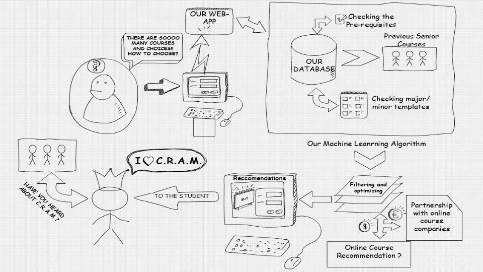

# CRAM - Google DevFest '16
***Automated modelling for course recommendations***

### Team members
* [Abhinav Agrawal](https://github.com/abhiagwl)
* [Karttikeya Mangalam](https://github.com/karttikeya)
* [Shivansh Rai](https://github.com/shivrai)

## The Idea


## Dependencies
* [python3](https://www.python.org/download/releases/3.0/)
* [django](https://www.djangoproject.com/)
* [beautifulsoup4](https://pypi.python.org/pypi/beautifulsoup4)
* [scikit-learn](http://scikit-learn.org/stable/)
* [pandas](http://pandas.pydata.org/)
* [numpy](http://www.numpy.org/)

### Tools used
* [Jupyter Notebook](http://jupyter.org/)

## Executing the scripts
The following commands should be run from `/cram`

### Functional tests
```
python3 manage.py test functional_tests
```

### Unit tests
```
python3 manage.py test users
```

### Running the server
There might possibly be some unapplied migrations when you run the app for the first time which may cause the app to not work properly. Use the following command to apply them.
```
python3 manage.py migrate
```

Finally, run the server.
```
python3 manage.py runserver
```
The website is served at [localhost:8000](http://localhost:8000)

### Cleaning up the database
**Update:** This is no longer required, recommendations are now generated on the fly.
```
rm db.sqlite3
python3 manage.py migrate --noinput
```

## Directory Structure
```
├── data_mining
│   └── ..............................:: Data scraping scripts
├── README.md
└── cram
    ├── db.sqlite3 ...................:: Database
    ├── functional_tests
    │   └── ..........................:: Functional testing scripts
    ├── users
    │   ├── admin.py
    │   ├── csv
    │   │   └── ......................:: CSV files
    │   ├── migrations
    │   ├── kball.py
    │   ├── models.py
    │   ├── scrape_user.py
    │   ├── static ...................:: Styling files
    │   │   └── base.css
    │   ├── templates
    │   │   └── home.html
    │   ├── tests.py .................:: Unit testing script
    │   └── views.py
    ├── manage.py
    └── cram
        ├── __init__.py
        ├── settings.py
        ├── urls.py
        └── wsgi.py
```
